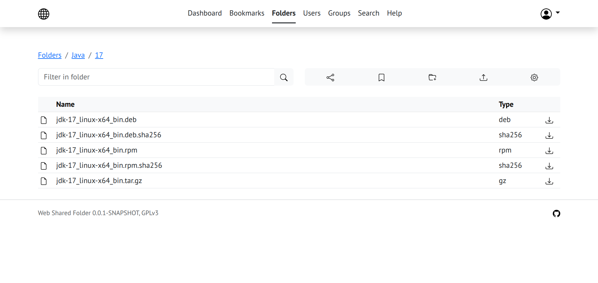

# Web shared folder

## Overview

A web-application to grant secure access to file system folders using HTTP
and Web browsers. Provides abilities to upload and download files,
manage files, folders, and users. It may be deployed both on regular
and virtual PC and can operate both on local and global networks.
It starts as a regular web server with a build-in file-based database
management system to store configuration and user information.

A typical usage scenario is to share files within a small or middle team or working group.



## License

The application is distributed under the GNU General Public License, version 3.
Bundled dependencies are distributed under its own open licenses, please explore
the corresponding original documentation.

## Deployment and running

There are some steps for application deployment. Put the JAR file
to a folder, run it and configure the superuser / administrator.
Also, it is strongly recommended to configure the SSL / TSL encryption
if the application is subject to use in a public or another unsecure network.

The only requirements to run is a Java Runtime Environment version 17 or higher
that can be taken from [Oracle Download Center](https://www.oracle.com/java/technologies/downloads/)
or from your operating system's repositories.

The application and all its dependencies bundled within a single
(uber) JAR file that can be run in a terminal as a regular JAR file, for example:

```shell
# Go to the application folder
cd /path/to/application/folder
# Run the application
java -jar wsf-<version>.jar
```

It is necessary that the directory with the JAR file is the current working directory
while the application starts because the application creates nested 'data' subdirectory
with a database during the first start and address it on the regular basis.

If you need an additional configuration:

- [Network port configuration](docs/NetworkPort.md)
- [SSL / TSL encryption configuration](docs/TSL.md)

## Working and shutdown

After the application has started, one can access it with a web browser by
the domain name or IP address as a regular website (additional network
configuration may be required):

For the same PC:

```text
http://localhost:8080/
http://127.0.0.1:8080/
```

For other PC:

```text
http://<your domain name>:8080/
http://<your IP address>:8080/
```

Network port 8080 is in use by default and can be configured.

To configure a superuser, go to the 'install' page and fill the form:

```text
http://<your domain name or IP>/install
```

After the superuser configured, the 'install' page is no longer available to access.

To shut down the application, use the application admin panel dedicated page.

### Update

To update the application, it is necessary to shut down it
and replace the existing JAR file by newer one.

Database migration will be performed automatically if needed.
It is strongly recommended to back up the 'data' sub-folder before JAR update.

To restore the application, one ought to restore the JAR file and the 'data' folder from backup by hand.

### Notes for developers

[See the dedicated file](docs/develop.md)
